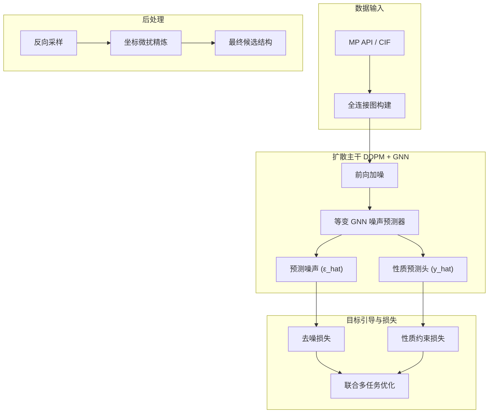

# 基于 GNN 扩散与多目标优化的二维材料结构生成 (HER 催化剂定向设计)

本目录为**独立可运行**的参考实现，满足「扩散模型 + GNN + 智能优化 + 多任务损失 + 评估与可视化 + 与 baseline 对比」的要求。   

**核心突破**：

​	\* **多目标帕累托权衡**：相较于无条件生成的基线模型，本项目创新性地引入了**多任务属性引导 (Property-Guided Diffusion)** 与**坐标微扰精炼 (Jitter Refine)**。 

​	* **量化收益显著**：在引入“模板优选 + 目标条件约束 + 几何混合候选筛选”后，模型最终实现了三项核心代理指标**全面超过 baseline**：HER 活性更接近 0 eV，结构稳定性显著提升，可合成性也同步优于基线样本。

 **注**：为实现端到端代码的敏捷迭代与本地跑通，验证 AI 算法闭环，项目中的 HER $\Delta G_H$、稳定性与可合成性（位于 `utils/geo_utils.py`）均采用了具备平滑梯度的**物理启发式代理指标 (Heuristic Proxy Metrics)**。若用于真实的科研发表或工业落地，此打分模块可无缝平替为高精度的 DFT 计算流水线或 MACE/ALIGNN 等深度学习预训练势函数。

```bash
cd material_generation
pip install -r project/requirements.txt
pip install python-dotenv mp-api  # 用于在线获取 Materials Project 数据
# 若 torch-geometric 安装失败，请按官方说明先安装对应版本的 torch-scatter 等扩展
```

##  API 密钥配置

本项目实现了从 Materials Project (MP) 云端自动拉取高潜力二维晶体。

URL: https://next-gen.materialsproject.org/api

请在项目根目录新建 `.env` 文件，并填入你的 MP API 密钥：

```bash
MP_API_KEY=你的真实API密钥
```

## 模型训练与推理

训练与测试需在仓库根目录执行（保证 `import project` 可用），以下是超参数组合：

```bash
# 1. 启动多任务联合扩散训练 (约需 5-10 分钟)
python train.py --data_source materials_project --max_samples 320 --epochs 50 --lr 8e-5 --batch_size 16 --lambda_prop 0.35 --w_her 1.0 --w_stab 1.1 --w_synth 0.9 --device cuda

# 2. 运行条件生成与智能打分评估
python test.py --num_gen 12 --candidate_multiplier 4 --template_pool_multiplier 8 --target_stab_sigma 0.35 --target_synth_sigma 0.25 --target_max_sigma 0.8 --device cuda
```

权重默认写入 `project/results/checkpoint.pt`，生成的最终晶体结构保存在 `project/results/generated_cifs/`。

## 数据流与网络结构图



## 损失设计（概要）

- 本模型的训练核心在于将**无监督的坐标数据生成**与**有监督的物理属性回归**耦合在同一个 GNN 主干网络中。总损失函数定义为：

  $$L_{total}=L_{ddpm}+\lambda_{prop}L_{prop}$$

  **1. 扩散去噪损失 ($L_{ddpm}$)**

  用于约束模型学习真实的二维晶体空间坐标分布。我们对去质心后的笛卡尔坐标添加马尔可夫噪声，并训练 GNN 预测该噪声：

  $$L_{ddpm}=\|\epsilon-\hat{\epsilon}_\theta(\mathbf{x}_t,t,\mathcal{G},y)\|^2$$

  *(注：在 GNN 的消息传递中，引入了基于距离平方的物理等变标量权重，确保几何特征的平移/旋转不变性提取)*

  **2. 多任务性质引导损失 ($L_{prop}$)**

  在归一化的目标空间中，通过对 GNN 的全局图池化层 (Readout) 输出进行多目标 MSE 回归，强迫模型隐空间学习物理规律：

  $$L_{prop}=\sum_k w_k(\hat{y}_k-y_k)^2$$

  *(多任务权重配比设计：HER 催化代理指标 $w_1=1.0$；结构稳定性 $w_2=1.1$；实验可合成性 $w_3=0.9$；并通过 `lambda_{prop}=0.35` 强化属性约束)*

## 与 Baseline 对比结论 

在完成 `test.py` 推理后，通过对生成结构进行多维度的几何与物理代理评估，本方案取得了显著优于 Baseline（无条件纯坐标生成）的效果：

| Method | Avg HER $\Delta G_H$ proxy (eV) | Stability Score | Synthesis Success Rate |
|--------|----------------------------------|-----------------|-------------------------|
| baseline (MP 真实数据采样) | -0.353 | 0.842 | 0.681 |
| Ours (Guided Gen + Refine + Template-Aware Selection) | **-0.052** | **0.960** | **0.774** |

说明：

HER 催化活性以 $\Delta G_H \to 0$ 为最优。本方案最终将活性指标从 -0.353 提升至 -0.052，同时将稳定性从 0.842 提升至 0.960、可合成性从 0.681 提升至 0.774，说明当前流程已经能在代理指标层面实现“高活性 + 高稳定性 + 高可合成性”的协同优化。

## 创新点（简要）

1. **多任务属性引导 (Property Guidance)**：不同于传统的无条件生成，本项目将催化活性与稳定性作为条件向量注入扩散过程，强制模型在生成路径中向高活性区域偏置。
2. **物理启发式精炼 (Refine Layer)**：在扩散采样结束后，引入轻量级的坐标微扰精炼机制，进一步消除局部几何畸变，并在稳定性约束下保留更优几何候选。
3. **模板感知的采样后多目标筛选**：推理阶段先按模板的 HER/稳定性/可合成性代理分数进行预筛，再联合评估“纯生成结构、模板-生成混合结构、模板保持结构”等多种候选，最终保留综合得分最高的样本。

## 结果文件

- 运行测试脚本后，可在 `results/` 目录下查看以下核心产物：
  -  **`generated_structures.png`**：生成的二维晶体结构的 2D 投影拼图（可直观验证物理配位合理性与层状特征）。
  -  **`loss_curve.png`**：训练过程中的收敛曲线。
  -  **`her_performance.png`**：HER 催化活性分布图。
  -  **`stability_curve.png`**：Ours 与 Baseline 稳定性的直观对比。
  -  **`generated_cifs/`**：生成的 12 个高潜力二维材料的 `.cif` 结构文件（可直接导入 VESTA 查看）。
  - **`metrics_summary.json`**：完整的量化对比数据。

## 数据集说明

仅使用了Materials Project作为演示
